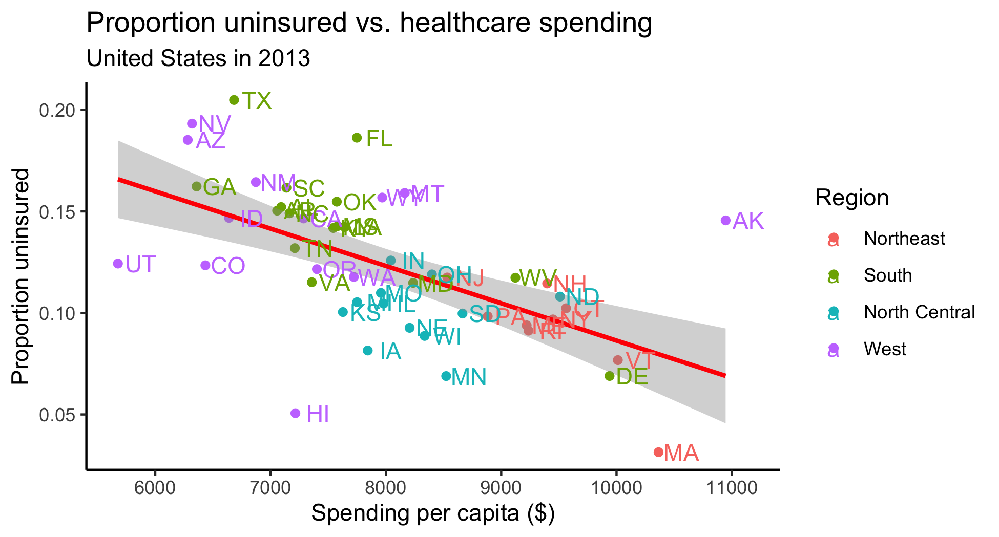

```{r setup, include = FALSE}
# load packages
library(tidyverse)
library(kableExtra)
library(datasets)
library(janitor)

# set code chunk defaults
knitr::opts_chunk$set(tidy = F, # display code as typed
                      size = "small", # slightly smaller code font
                      message = FALSE,
                      warning = FALSE,
                      comment = "\t") 

# set black & white default plot theme
theme_set(theme_classic()) 

# improve digit and NA display 
options(scipen = 1, knitr.kable.NA = '')
```

# **About this lab** {-}

These exercises are designed to give you practice wrangling and tidying data, both from a *processes* perspective (what needs to be done to the data before I can run my fancy analysis and/or make my cool visualization?) and an *R implementation* perspective (how do I implement those steps specifically in R?).

In this lab we will work with the **tidyverse**, **datasets**, and **janitor** packages. The **datasets** package contains a dataset `state` with information on each state such as region.

These have been loaded for you in the `setup` code chunk, but scroll up to verify and load any packages that I may have missed (and of course install any packages that are not yet on your machine).


# **Exploring Health Expenditure using State-level data** {-}

This case study is based on an open case study from the OCS project (Kuo et al. 2019).

Health policy in the United States is complicated, and several forms of health care coverage exist, including both federal government-led health care policy, and private insurance company. Before making any inference about the relationship between health condition and health policy, it is important for us to have a general idea about health care economics in the United States. Thus, we are interested in getting a sense of the health expenditure, including health care coverage and health care spending, across the United States.

Motivating questions:

* Is there a relationship between health care spending and health care coverage by employers in the United States?
* How does the spending distribution change across geographic regions in the United States?
* Does the relationship between health care coverage and health care spending in the United States change from 2013 to 2014?


## The data {-}

Data for this lab come from the Henry J Kaiser Family Foundation (KFF).

* [Health Insurance Coverage of the Total Population (2013 -- 2016)](https://www.kff.org/other/state-indicator/total-population/)
     
* [Health Care Expenditures in millions by State of Residence (1991 -- 2014)](https://www.kff.org/other/state-indicator/health-care-expenditures-by-state-of-residence-in-millions/?currentTimeframe=0&sortModel=%7B%22colId%22:%22Location%22,%22sort%22:%22asc%22%7D)

\normalfont

<!-- Part 1 ------------------------------------------------------------------->
#  <!-- 1 -->**Understanding the data** 

## <!-- 1.1 --> Since our goal is to get a sense of the health expenditure, including health care coverage and health care spending, across states, it would be nice add some information about each state. Namely, the state abbreviation and state region (i.e. north, south, etc). For this we use the various state datasets in the **datasets** R package.  Since the package is already loaded, we can refer directly to any of the state datasets (e.g., `state.abb`) even though we don't them loaded in our environment. However, we can make the `state` datasets appear in our environment by running `data(state)`. 

```{r}
# Load state datasets into environment
data(state) 
```

## <!-- 1.2 -->The state data are split across 7 datasets, all arranged according to alphabetical order of the state names. There are no other variables that can link the datasets together, so we will trust the alphabetical ordering and create our own dataframe from three of the datasets.

```{r}
# Create a data frame with state info
state_info <- data.frame(location = state.name, 
                         abbreviation = state.abb, 
                         region = state.region)
```

## <!-- 1.3 -->Run the code below to use `read_csv()` to read in the files containing the healthcare coverage and healthcare spending data. Pay attention to the filepath, making modifications if needed based on your own file organization. 

```{r}
coverage <- read_csv("data/healthcare_coverage.txt")
spending <- read_csv("data/healthcare_spending.txt")
```

## <!-- 1.4 -->Now get acquainted with the `coverage` and `spending` datasets.  What years are covered in the `coverage` dataset?  What years are covered in the `spending` dataset?  (Yes, the answers to these questions are above, but how can you confirm this in the datasets?) Are there any mismatches between how R specified the variable type and what you expected the type would be?

Using the `glimpse()` function, we can see the `coverage` dataset covers the years 2013 to 2016 and the `spending` dataset covers the years 1991 to 2014. We also see that the variables ending in "Other Public" are being treated as characters.

```{r}
glimpse(coverage)

glimpse(spending)
```

## <!-- 1.5 -->The previous question was intentionally leading---you should have identified some mismatched variable types in the `coverage` dataset. This happened because missing numeric values were recorded as text ("N/A") instead of left empty. Run the code below to fix this problem.

```{r}
coverage <- coverage %>% 
  na_if("N/A") %>% 
  mutate(across(.cols = ends_with("Public"), 
                .fns = as.numeric))
```


## <!-- 1.6 -->If we're interested in the relationship between spending and coverage, we'll only be able to use observations that have information on both.  That is, we won't be using data from years for which we only have spending information or only have coverage information. Remove any variables we won't be using from `coverage` and `spending`.  *Hint*: the `starts_with()` function from the **tidyselect** package (already loaded) could help with efficiency here. 

```{r}

```

## <!-- 1.7 -->There are 50 states in the United States but 52 observations in the `coverage` and `spending` datasets. The two "bonus" cases contain information about the US as a whole and Washington DC.  Remove these observations from both datasets.

```{r}

```

<!--
Have you been committing and pushing? Now's a good time! "Add answers to Part 1"
-->

<!-- Part 2 ------------------------------------------------------------------->
# <!-- 2 -->**Is there a relationship between healthcare spending and healthcare coverage by employers in the United States?** We'll want to create a scatterplot with `log(spending)` on the $x$-axis and `log(employer coverage)` on the $y$-axis, with the points colored by year.  (*Why logs?* Both these variables are right-skewed and have large outliers; feel free to check out their histograms and/or look at the un-logged scatterplot if you'd like, as well.)  This is a simple enough scatterplot, but we'll need to do a bit of data tidying before the data are in an appropriate format to create the plot.

## <!-- 2.1 -->First, sketch what the scatterplot should look like on paper or Google jamboard or some other app (what are the axes? what does each point represent?). What does your dataset need to look like in order to create the scatterplot in `ggplot()`? What will each observation (row) in the dataset represent? What variables (columns) do you need?


## <!-- 2.2 -->What are some of the steps that will need to be taken to get the data in that form?  


## <!-- 2.3 -->Now implement those steps in R, tidying the dataset for plotting.  After the final step, use the `clean_names()` function from the **janitor** package to clean the variable names.  Then, create the scatterplot!

```{r}

```

<!--
Whew! You just did a lot. Consider committing and pushing now: 
"Add answers to Part 2"
-->

<!-- Part 3 ------------------------------------------------------------------->
# <!-- 3 -->**Adjusting for population size** We see there is a strong relationship between healthcare spending and coverage within each year. However, we might suspect that health care coverage and spending are each strongly related to population size.  In the `coverage` dataset, the "total" coverage category is not really a formal type of health care coverage; it actually represents the total number of people in the state in that year. This is useful information!  

## <!-- 3.1 -->Using the dataset you created in Part 2, rename the `total` column to  `total_population` to make the variable name more informative. Create a scatterplot of employer coverage versus population size (*note*: "plot blank vs blank" means "plot y variable vs x variable"). Then create a second scatterplot of healthcare spending vs. population size. What do you notice?


```{r}

```


## <!-- 3.2 -->To account for total population, create a scatterplot of spending per capita versus proportion with employer coverage.  This time, *color by region* and *facet by year* (think about what additional steps you need to take to make this happen!).  The total spending column is reported in millions (`1e6`). Therefore, to calculate `spending_per_capita` we will need to adjust for this scaling factor to report it on the original scale (just dollars) and then divide by `total_population`.  Based on this figure, write a brief paragraph describing the relationship between health care spending and coverage in the US.

 

```{r}

```

<!--
Commit and push! "Add answers to Problem 3"
-->

<!-- Part 4 ------------------------------------------------------------------->
# <!-- 4 -->**How does spending vary by state and region?**

## <!-- 4.1 -->Which US state spent the most per capita on health care in 2013? 2014? The least in each year?  


```{r}

```

## <!-- 4.2 -->How does the spending distribution change across geographic region in the US?  Create an appropriate figure to visualize the distribution of spending per capita on health care by region.  Write one paragraph summarizing a comparison of the distributions.  (Note that you probably will also want to generate summary statistics by region in order to include specific values in your summary paragraph.)

The distributions look similar in 2013 and 2014. Spending per capita is highest and has the least variability in the Northeast (median around $9,500 and IQR around $300). The most variability in spending is in the West, which has a median of around $7,300, an IQR around $1,200, and a large outlier at over $10,000. The North Central and South regions have medians around $8,100 and $7,500, respectively and both have outliers on the high side.

```{r}

```

<!--
Commit and push! "Add answers to Problem 4"
-->

<!-- Part 5 ------------------------------------------------------------------->
# <!-- 5 -->**Does the relationship between healthcare spending and the proportion of uninsured in the United States change from 2013 to 2014?**

## <!-- 5.1 -->Re-create the plot below for 2013. *Hint*: use `nudge_x` and/or `nudge_y` in the `geom_text()` layer.

 

```{r, fig.width = 6.5, fig.height = 3.5}
# Add proportion uninsured to dataset
healthcare <- healthcare %>%
  mutate(proportion_uninsured = uninsured / total_population)

healthcare %>% 
  filter(year == "2013") %>% 
  ggplot(aes(x = spending_per_capita, y = proportion_uninsured, 
             color = region)) + 
  geom_point() + 
  geom_smooth(method = "lm", col = "red") + 
  geom_text(aes(label = abbreviation), nudge_x = 200) +
  labs(x = "Spending per capita ($)", 
       y = "Proportion uninsured", 
       color = "Region",
       title = "Proportion uninsured vs. healthcare spending",
       subtitle = "United States in 2013")
```

## <!-- 5.2 -->Next, create an analogous plot (separately) for 2014. Does the relationship between health care spending and the proportion of uninsured change from 2013 to 2014?

The relationship between healthcare spending and the proportion uninsured looks pretty similar from 2013 to 2014.

```{r fig.width = 6.5, fig.height = 3.5}
healthcare %>% 
  filter(year == "2014") %>% 
  ggplot(aes(x = spending_per_capita, y = proportion_uninsured, 
             color = region)) + 
  geom_point() + 
  geom_smooth(method = "lm", col = "red") + 
  geom_text(aes(label = abbreviation), nudge_x = 200) +
  labs(x = "Spending per capita ($)", 
       y = "Proportion uninsured", 
       color = "Region",
       title = "Proportion uninsured vs. healthcare spending",
       subtitle = "United States in 2014")
```

## <!-- 5.3 -->Now combine your two plots into one graph, creating one figure that is facetted by year and still colored by region. 

```{r fig.width = 6.5, fig.height = 6}
healthcare %>% 
  ggplot(aes(x = spending_per_capita, y = proportion_uninsured, 
             color = region)) + 
  geom_point() + 
  geom_smooth(method = "lm", col = "red") + 
  geom_text(aes(label = abbreviation), nudge_x = 200) +
  facet_wrap(~ year, nrow = 2) + 
  labs(x = "Spending per capita ($)", 
       y = "Proportion uninsured", 
       color = "Region",
       title = "Proportion uninsured vs. healthcare spending",
       subtitle = "United States, 2013-2014")
```

## <!-- 5.4 -->Lastly, plot the points for both years on the same plot, this time colored by year instead of region.  Make sure to specify the `group` aesthetic for year as well to get two lines. Which of these three visualizations do you find most helpful for comparing the relationship between 2013 and 2014?  Why?

I think the last one where both years are on the same figure (colored by year instead of region) is most helpful for comparing the relationship between 2013 and 2014. We lose the visual cue of region, but it’s easiest for me to see the change in the relationship when the points and lines are on the same plot.

```{r fig.width = 6.5, fig.height = 3.5}
healthcare %>% 
  ggplot(aes(x = spending_per_capita, y = proportion_uninsured, 
             color = year, group = year)) + 
  geom_point() + 
  geom_smooth(method = "lm") + 
  geom_text(aes(label = abbreviation), nudge_x = 200) +
  labs(x = "Spending per capita ($)", 
       y = "Proportion uninsured", 
       color = "Year",
       title = "Proportion uninsured vs. healthcare spending",
       subtitle = "United States, 2013-2014")
```

<!--
Commit and push! "Add answers to Problem 5"
-->

# <!-- 6 -->**Bonus** Done early?  Try to figure out how to make these additional updates to the first figure from the last exercise to hone your plotting skills:

> * remove the "a" on the points in the legend 
> * change the background to be grey
> * make the numbers on the x-axis larger
> * change the font of the text on the y-axis

```{r}

```


# References {-}

Kuo, Pei-Lun and Jager, Leah and Taub, Margaret and Hicks, Stephanie. (2019, February 14). opencasestudies/ocs-healthexpenditure: Exploring Health Expenditure using State-level data in the United States (Version v1.0.0). Zenodo. http://doi.org/10.5281/zenodo.2565307


