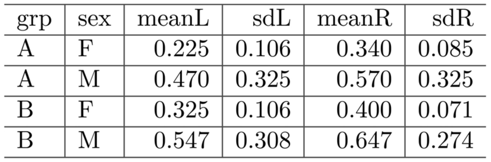
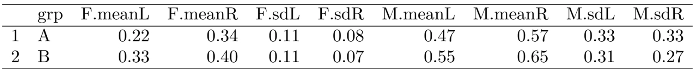

# **Practice Set Information** {-}

During the week, you will get further practice with the material by working through the Practice Set, a set of problems designed to give you practice beyond the examples produced in the text. 

You may work through these problems with peers, but all work must be completed by you (see the Honor Code in the syllabus) and you must indicate who you worked with below. 

Even then, the best approach here is to try the problems on your own before discussing them with peers, and then write your final solutions yourself.


## **GitHub Workflow** {-}

1. Before editing this file, verify you are working on the copy saved in *your* repo for the course (check the filepath and the project name in the top right corner). 

2. Before editing this file, make an initial commit of the file to your repo to add your copy of the problem set. 

3. Change your name at the top of the file and get started! 

4. You should *save, knit, and commit* the .Rmd file each time you've finished a question, if not more often. You should also *push* your commits back onto GitHub occasionally (you can do this after each commit). 

6. When you think you are done with the assignment, save the pdf as "*Name*\_*thisfilename*\_*date*.pdf" before committing and pushing (this is generally good practice but also helps me in those times where I need to download all student homework files).

## **Gradescope Upload** {-}

For each question (e.g., 3.1), allocate all pages associated with the specific question. If your work for a question runs onto a page that you did not select, you may not get credit for the work. If you do not allocate *any* pages when you upload your pdf, you may get a zero for the assignment.

You can resubmit your work as many times as you want before the deadline, so you should not wait until the last minute to submit some version of your work. Unexpected delays/crises that occur on the day the assignment is due do not warrant extensions (please submit whatever you have done to receive partial credit).

\clearpage
# **Practicing Academic Integrity** {-}

If you worked with others or used resources outside of provided course material (notes, textbook, etc) to complete this assignment, please acknowledge them below using a bulleted list. 
\normalfont

<!-- ~~~~~~~~~~~~~~~~ YOU MAY BEGIN EDITING BELOW THIS LINE ~~~~~~~~~~~~~~~~ -->

*I acknowledge the following individuals with whom I worked on this assignment:*

Name(s) and corresponding problem(s)

*

*I used the following sources to help complete this assignment:*

Source(s) and corresponding problem(s)

* 

```{r setup, include = FALSE}
# load packages
library(mdsr)
library(tidyverse)
library(kableExtra)

# set code chunk defaults
knitr::opts_chunk$set(tidy = F, # display code as typed
                      size = "small", # slightly smaller code font
                      message = FALSE,
                      warning = FALSE,
                      comment = "\t") 

# set black & white default plot theme
theme_set(theme_classic()) 

# improve digit and NA display 
options(scipen = 1, knitr.kable.NA = '')
```

<!-- PROBLEM 1 ---------------------------------------------------------------->
# <!-- 1 -->**MDSR 5.2**   Use the `Batting`, `Pitching`, and `Master` tables in the **Lahman** package to answer the following questions.

## <!-- 1.1 -->List the name of every player in baseball history who has accumulated at least 300 home runs (HR) and at least 300 stolen bases (SB). You can find the first and last name of the player in the `Master` data frame. Join this to your result along with the total home runs and total bases stolen for each of these elite players.

```{r}

```

## <!-- 1.2 -->Similarly, list the names every pitcher in baseball history who has accumulated at least 300 wins (W) and at least 3,000 strikeouts (SO).

```{r}

```

## <!-- 1.3 -->Finally, list the name and year of every player who has hit at least 50 home runs in a single season. Which player had the lowest batting average in that season? Note: Batting average is calculated as the number of hits (H) divided by the number of at bats (AB).


```{r}

```


<!-- PROBLEM 2 ---------------------------------------------------------------->
# <!-- 2 -->**MDSR 4.11 (modified)** The `Violations` data set in the **mdsr** package contains information regarding the outcome of health inspections of restaurants in New York City. Note that higher inspection scores indicate worse violations: "restaurants with an inspection score between 0 and 13 points earn an A, those with 14 to 27 points receive a B and those with 28 or more a C" ([nyc.gov](https://www1.nyc.gov/assets/doh/downloads/pdf/rii/how-we-score-grade.pdf)).

## <!-- 2.1 -->Use these data to calculate the median violation score by zip code for zip codes in Manhattan. What pattern, if any, do you see between the number of inspections and the median score? Generate a visualization to support your response.  
  


```{r}

```

## <!-- 2.2 -->In your visualization above, there are several potential outliers but there is one zipcode in particular that does not seem to fall along the general trend. Add text to the outlier identifying what zipcode it is, and add an arrow pointing from the text to the observation. Note: first, you may want to `filter()` to identify the zipcode (so you know what text to add to the plot).  

<!--
(Can't remember how to create a curved arrow in `ggplot()`?  

The answers to [this question](https://stackoverflow.com/questions/38008863/how-to-draw-a-nice-arrow-in-ggplot2/61383034) on Stack Exchange may help.  

Can't remember how to add text to the plot in `ggplot()`? 

Check out the text examples with `annotate()` [here](https://ggplot2.tidyverse.org/reference/annotate.html), or answers to [this question](https://stackoverflow.com/questions/14351608/color-one-point-and-add-an-annotation-in-ggplot2/14351810) that use `geom_text`.)
-->

```{r}

```


<!-- PROBLEM 3 ---------------------------------------------------------------->
# <!-- 3 -->**MDSR 6.5** Generate the code to convert the data frame from the starting point (Figure 1) to the results (Figure 2).  Hint: use `pivot_longer()` in conjunction with `pivot_wider()`.

{width=40%}

{width=80%}

```{r}

```


<!--
Congrats! You've made it to the end. If you think you are done, read the instructions for how to do the final commit + push, this time including your renamed pdf, and upload your pdf to Gradescope.
-->
